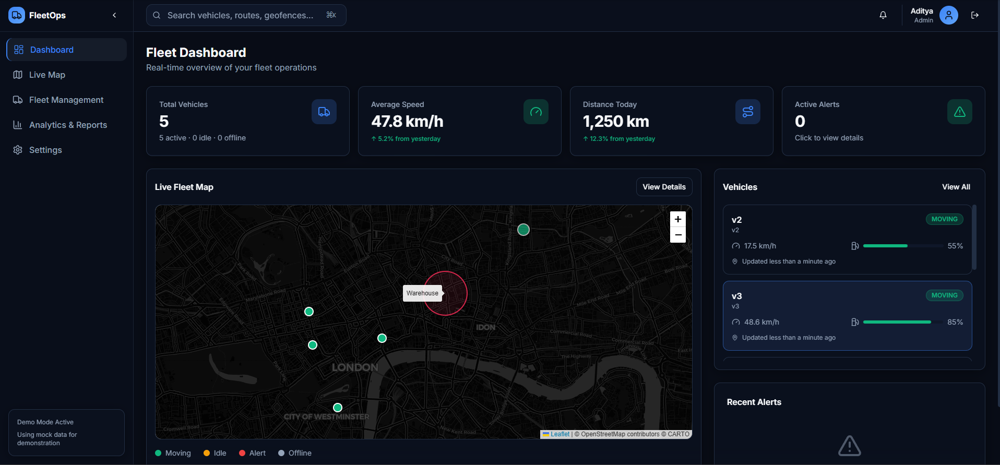

# IoT Fleet Management System



A real-time fleet management solution built with modern web technologies and IoT protocols. This system enables real-time tracking of vehicles, geofence management, and historical analytics using a high-performance time-series database.

## 🚀 Features

- **Real-time Tracking**: Live updates of vehicle locations, speed, and status on an interactive map.
- **Geofencing**: Create and manage circular geofences with visual feedback.
- **Live Telemetry**: Monitor fuel levels, engine temperature, and vehicle status (Moving, Idle, Offline).
- **Analytics Dashboard**: Visual insights into fleet performance, speed trends, and distance metrics.
- **Event Simulation**: Integrated simulator to generate realistic vehicle traffic and telemetry data.
- **Responsive Design**: Modern, glassmorphism-inspired UI built with Tailwind CSS.

## ⏳ Performance & Optimization

I have integrated **Redis** to cache real-time vehicle telemetry, resulting in a significant reduction in API latency and database load.


- **Latency**: Reduced from ~92ms to ~32ms (**~3x improvement**).
- **Scalability**: Decoupled read operations from the primary Time-series database, enabling high-concurrency for dashboard viewers.

## 🛠️ Tech Stack

### Frontend
- **Framework**: React 18 (Vite)
- **State Management**: Zustand
- **Styling**: Tailwind CSS, Shadcn UI
- **Maps**: Leaflet / React-Leaflet
- **Charts**: Recharts

### Backend
- **API**: FastAPI (Python)
- **Database**: TimescaleDB (PostgreSQL extension for time-series data)
- **Caching**: Redis (Real-time state and statistics)
- **Message Broker**: Eclipse Mosquitto (MQTT)
- **Containerization**: Docker & Docker Compose

## 📋 Prerequisites

- [Docker Desktop](https://www.docker.com/products/docker-desktop) installed and running.
- Git

## ⚡ Getting Started

1.  **Clone the repository**
    ```bash
    git clone https://github.com/Aditya19Joshi01/IoT-fleet-management.git
    cd fleet-management
    ```

2.  **Environment Setup**
    Copy the example environment file:
    ```bash
    cp .env.example .env
    ```
    *Note: The default credentials in `.env.example` work out-of-the-box for local development.*

3.  **Run the System**
    Start all services using Docker Compose:
    ```bash
    docker-compose up -d --build
    ```

4.  **Access the Application**
    - **Frontend Dashboard**: [http://localhost](http://localhost)
    - **Backend API Docs**: [http://localhost:8000/docs](http://localhost:8000/docs)

## 🏗️ Project Structure

```
fleet-management/
├── backend/                 # FastAPI application
│   ├── app/
│   │   ├── routers/        # API endpoints (vehicles, geofences, analytics)
│   │   ├── models.py       # Pydantic models
│   │   └── mqtt_service.py # MQTT consumer logic
│   ├── tests/              # Pytest unit tests
│   └── Dockerfile
├── frontend/                # React application
│   ├── src/
│   │   ├── components/     # Reusable UI components
│   │   ├── pages/          # Main application pages
│   │   ├── tests/          # Vitest component tests
│   │   └── store/          # Zustand state management
│   └── Dockerfile
├── simulator/               # Python vehicle simulator
│   ├── tests/              # Simulator unit tests
│   └── simulator.py
├── .github/
│   └── workflows/          # CI/CD pipelines
├── mosquitto/               # MQTT broker config
└── docker-compose.yaml      # Service orchestration
```

## 🧪 Testing

The project is fully tested across all components.

### Backend
Run unit tests for API endpoints and logic:
```bash
cd backend
python -m pytest tests/test_main.py
```

### Frontend
Run component integration tests:
```bash
cd frontend
npm test
```

### Simulator
Run verification tests for telemetry generation:
```bash
python -m unittest simulator/tests/test_simulator.py
```

## 🔄 CI/CD Pipeline

A GitHub Actions workflow (`.github/workflows/ci.yml`) is configured to automatically run all tests on every push and pull request to the `main` branch.

- **Backend Job**: Runs `pytest` on Python 3.11.
- **Frontend Job**: Runs `vitest` on Node.js 20.
- **Simulator Job**: Runs `unittest`.

## 🔧 API Documentation

The backend provides a fully documented Swagger UI. Once running, visit:
[http://localhost:8000/docs](http://localhost:8000/docs)

## 🤝 Contributing

1.  Fork the repository
2.  Create your feature branch (`git checkout -b feature/AmazingFeature`)
3.  Commit your changes (`git commit -m 'Add some AmazingFeature'`)
4.  Push to the branch (`git push origin feature/AmazingFeature`)
5.  Open a Pull Request

## 📄 License

Distributed under the MIT License. See `LICENSE` for more information.
